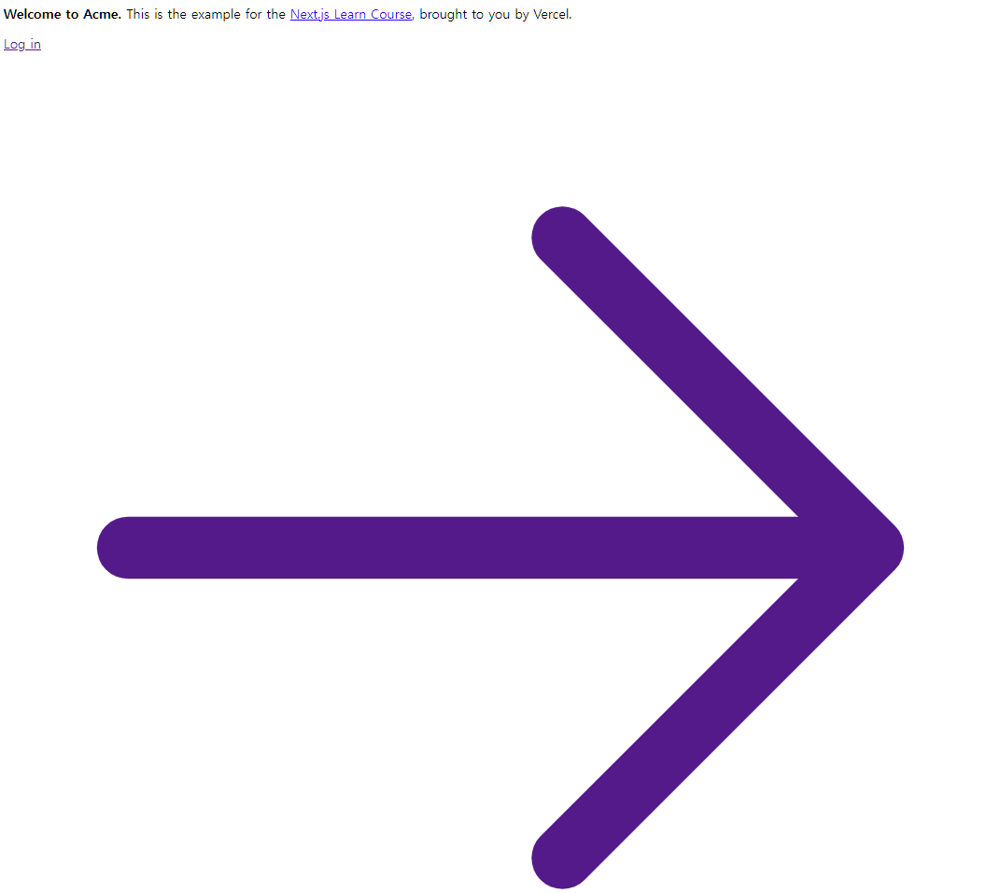
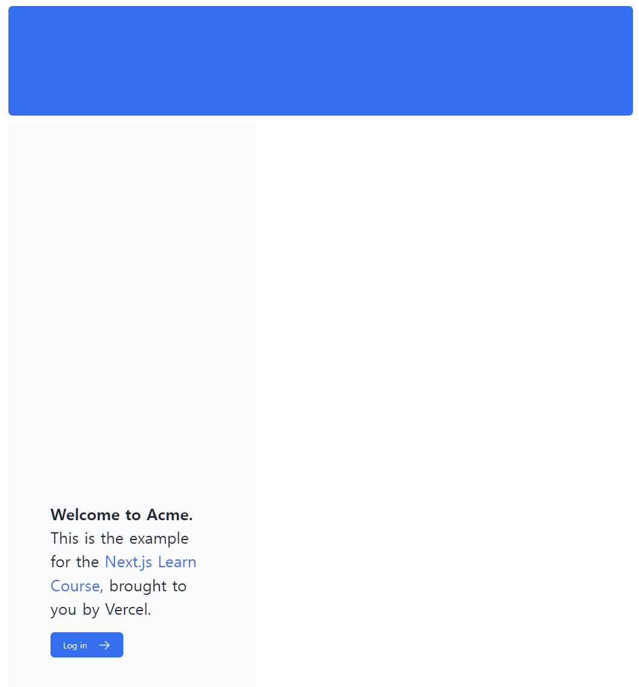

# css styling

## 이번 장에서 배우는 것

- 글로벌 css 를 app에 추가하는 방법
- 2가지 방식 : tailwind css 와 css 모듈
- clsx 유틸 패키지를 사용하여 조건부 클래스를 추가하는 방법

## 글로벌 스타일 추가하기

/app/layout.tsx

```tsx
// 맨 위에 추가
import '../styles/globals.css'
```

### 추가 전



### 추가 후



## tailwind

[Tailwind](https://tailwindcss.com/) CSS 유틸 클래스를 빠르게 작성할 수 있도록 하여 개발 프로세스 속도를 높이는 CSS 프레임워크입니다.

CSS 스타일은 전역적으로 공유되지만 각 클래스는 각 요소에 개별적으로 적용됩니다. 즉, 요소를 추가하거나 삭제하는 경우 별도의 스타일시트 유지 관리, 스타일 충돌 또는 애플리케이션 확장에 따른 CSS 번들 크기 증가에 대해 걱정할 필요가 없습니다.

```tsx
<h1 className="text-blue-500">I'm blue!</h1>
```

위와 같이 입력하면 푸른색 "I'm Blue!" 가 작성 됩니다.

## css 모듈

- `app/ui/home.module.css` 파일 생성

```css
.shape {
  height: 0;
  width: 0;
  border-bottom: 30px solid black;
  border-left: 20px solid transparent;
  border-right: 20px solid transparent;
}

```

```tsx

import styles from '@/app/ui/home.module.css';

// 임포트.클래스명 형태로 사용 가능
// 이렇게 사용하면 로컬에서 동작하여 클래스명이 겹치지 않는다.
<div className={styles.shape} />
```

위 내용은 컴파일 시 `<div class="home_shape__hPvH_"></div>` 와 같은 형태로 보여지게 된다
만약 다른 tsx 파일에서 import 하여 사용한 경우에는 위 class 명과 다른 형태로 생성되게 된다

## `clsx` 라이브러리를 통한 동적 클래스 반영

```tsx
import clsx from 'clsx';
 
export default function InvoiceStatus({ status }: { status: string }) {
  return (
    <span
      className={clsx(
        'inline-flex items-center rounded-full px-2 py-1 text-sm',
        {
          'bg-gray-100 text-gray-500': status === 'pending',
          'bg-green-500 text-white': status === 'paid',
        },
      )}
    >
    // ...
)}
```

---

### tips

- `Unknown at rule @tailwindcss` 라고 출력되는 경우 vscode에서 `PostCSS Language Support` 확장을 설치하면 된다. [더 보기](https://velog.io/@jinsunkimdev/React%EC%97%90%EC%84%9C-TailwindCSS-%EC%82%AC%EC%9A%A9-%EC%8B%9C-warning-Unknown-at-rule-tailwind-css)
- [Github 이미지 사이즈 조절 & 정렬](https://blog.yena.io/studynote/2017/11/23/Github-resize-image.html)
- [Github Pages (github 블로그)를 운영할때 추천하는 vscode 플러그인 2](https://etch-cure.github.io/blog/github-pages-plugin2/)
- [vscode - markdownlint](https://github.com/DavidAnson/vscode-markdownlint#configure)
