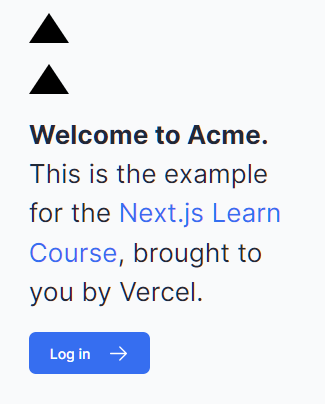

# 03 optimizing fonts and images

## 폰트 최적화

> 추가 네트워크 요청이 없도록 다른 정적 자산과 함께 글꼴 파일을 호스팅

누적 레이아웃 변경을 최소화 하여 사용자의 경험을 향상 시킨다.
폰트가 변경되면 ( system font -> embedding font ) 레이아웃이 변경되어 리플로우가 발생하기 때문

## 글꼴 추가




```tsx
// -=> /app/ui/fonts.ts
import { Inter } from 'next/font/google';

export const inter = Inter({ subsets: ['latin'] });

// -=> /app/layout.tsx
// 구글 폰트 검색 : https://fonts.google.com/
// 모든 폰트가 next font 로 반환되는 것은 아님에 유의
import '@/app/ui/global.css';
import { inter } from '@/app/ui/fonts';

export default function RootLayout({
  children,
}: {
  children: React.ReactNode;
}) {
  return (
    <html lang="en">
      <body className={`${inter.className} antialiased`}>{children}</body>
    </html>
  );
}
```

## 이미지 최적화

일반 HTML을 사용하면 다음과 같이 이미지를 추가할 수 있습니다.

```html

```

그러나 이는 수동으로 다음을 수행해야 함을 의미합니다.

- 이미지가 다양한 화면 크기에 반응하는지 확인하세요.
- 다양한 장치에 대한 이미지 크기를 지정합니다.
- 이미지가 로드될 때 레이아웃이 바뀌는 것을 방지합니다.
- 사용자 뷰포트 외부에 있는 지연 로드 이미지입니다.

이미지 최적화는 그 자체로 전문 분야로 간주될 수 있는 웹 개발의 큰 주제입니다. 이러한 최적화를 수동으로 구현하는 대신 next/image구성 요소를 사용하여 이미지를 자동으로 최적화할 수 있습니다.

tailwind : md: - 모바일 디바이스 일때 동작처리

```tsx
import AcmeLogo from '@/app/ui/acme-logo';
import { ArrowRightIcon } from '@heroicons/react/24/outline';
import Link from 'next/link';
import { lusitana } from '@/app/ui/fonts';
import Image from 'next/image';

export default function Page() {
  return (
    // ...
    <div className="flex items-center justify-center p-6 md:w-3/5 md:px-28 md:py-12">
      {/* Add Hero Images Here */}
      <Image
        src="/hero-desktop.png"
        width={1000}
        height={760}
        className="hidden md:block"
        alt="Screenshots of the dashboard project showing desktop version"
      />
    </div>
    //...
  );
}
```

## 반응형 디자인

접두사 기준 최소 길이를 초과하는 경우에 따라 스타일을 반영한다

| Breakpoint prefix | Minimum width | CSS                                  |
| ----------------- | ------------- | ------------------------------------ |
| `sm`              | 640px         | `@media (min-width: 640px) { ... }`  |
| `md`              | 768px         | `@media (min-width: 768px) { ... }`  |
| `lg`              | 1024px        | `@media (min-width: 1024px) { ... }` |
| `xl`              | 1280px        | `@media (min-width: 1280px) { ... }` |
| `2xl`             | 1536px        | `@media (min-width: 1536px) { ... }` |

## 참조링크

- [google : fonts](https://fonts.google.com/)
- [using-multiple-fonts](https://nextjs.org/docs/app/building-your-application/optimizing/fonts#using-multiple-fonts)
- [font-function-arguments](https://nextjs.org/docs/app/api-reference/components/font#font-function-arguments)
- [responsive-design](https://tailwindcss.com/docs/responsive-design)
- [optimizing/images](https://nextjs.org/docs/app/building-your-application/optimizing/images)
- [optimizing/fonts](https://nextjs.org/docs/app/building-your-application/optimizing/fonts)
- [Performance/Multimedia](https://developer.mozilla.org/en-US/docs/Learn/Performance/Multimedia)
- [Styling_text/Web_fonts](https://developer.mozilla.org/en-US/docs/Learn/CSS/Styling_text/Web_fonts)
