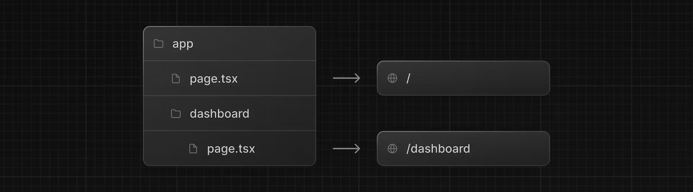
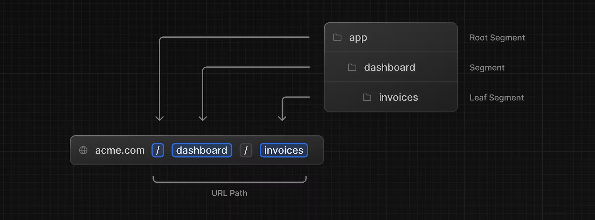
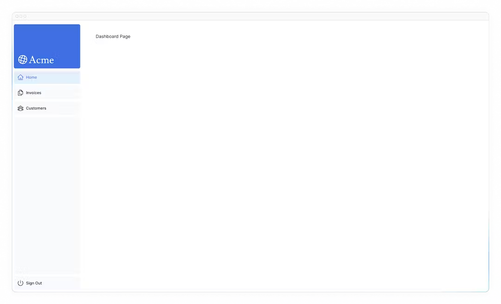
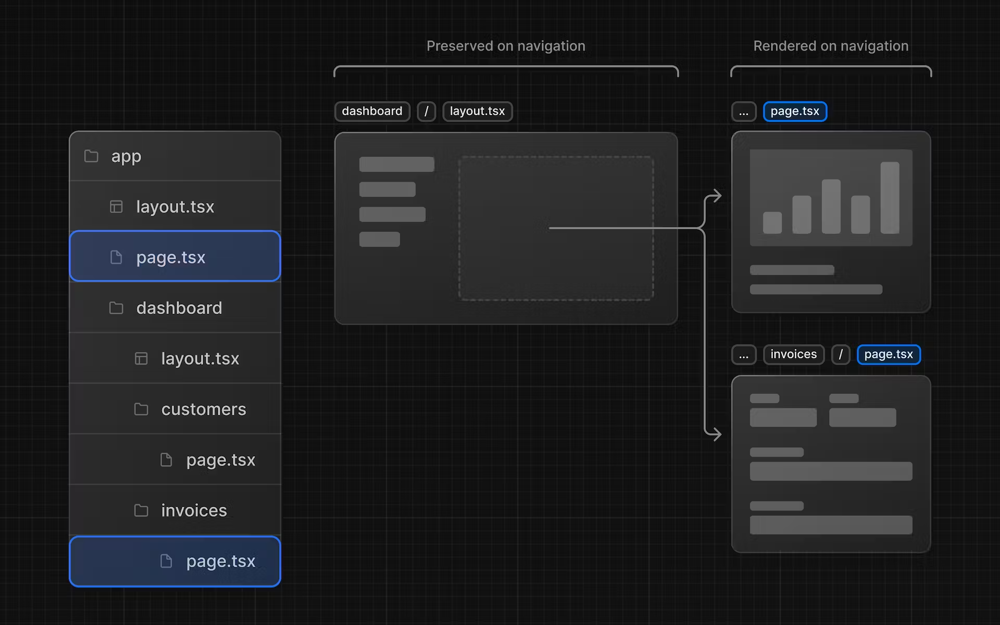

# 04 creating layouts and pages

## 이 장에서 배울 것

- dashboard파일 시스템 라우팅을 사용하여 경로를 만듭니다 .
- 새 경로 세그먼트를 생성할 때 폴더와 파일의 역할을 이해합니다.
- 여러 대시보드 페이지 간에 공유할 수 있는 중첩 레이아웃을 만듭니다.
- 코로케이션, 부분 렌더링, 루트 레이아웃이 무엇인지 이해합니다.

## 중첩 라우팅




URL Path 각각의 세그먼트 기준으로 화면을 구성할 수 있다.

- layout.tsx : 레이아웃 구성 파일, 레이아웃은 하위 page에 영향을 미칠 수 있다.
- page.tsx : 현재 페이지 구성 파일

## 대시보드 만들기

파일 에 특별한 이름을 지정함으로써 pageNext.js를 사용하면 UI 구성 요소, 테스트 파일 및 기타 관련 코드를 경로와 함께 [배치 할 수](https://nextjs.org/docs/app/building-your-application/routing#colocation) 있습니다.

```tsx
// => /app/dashboard/page.tsx
// http://localhost:3000/dashboard
export default function Page() {
  return <p>Dashboard Page</p>;
}
```

## 대시보드 레이아웃 만들기

대시보드에는 여러 페이지에서 공유되는 일종의 탐색 기능이 있습니다. Next.js에서는 특수 layout.tsx파일을 사용하여 여러 페이지 간에 공유되는 UI를 만들 수 있습니다




## 참조 링크

- [routing#colocation](https://nextjs.org/docs/app/building-your-application/routing#colocation)
