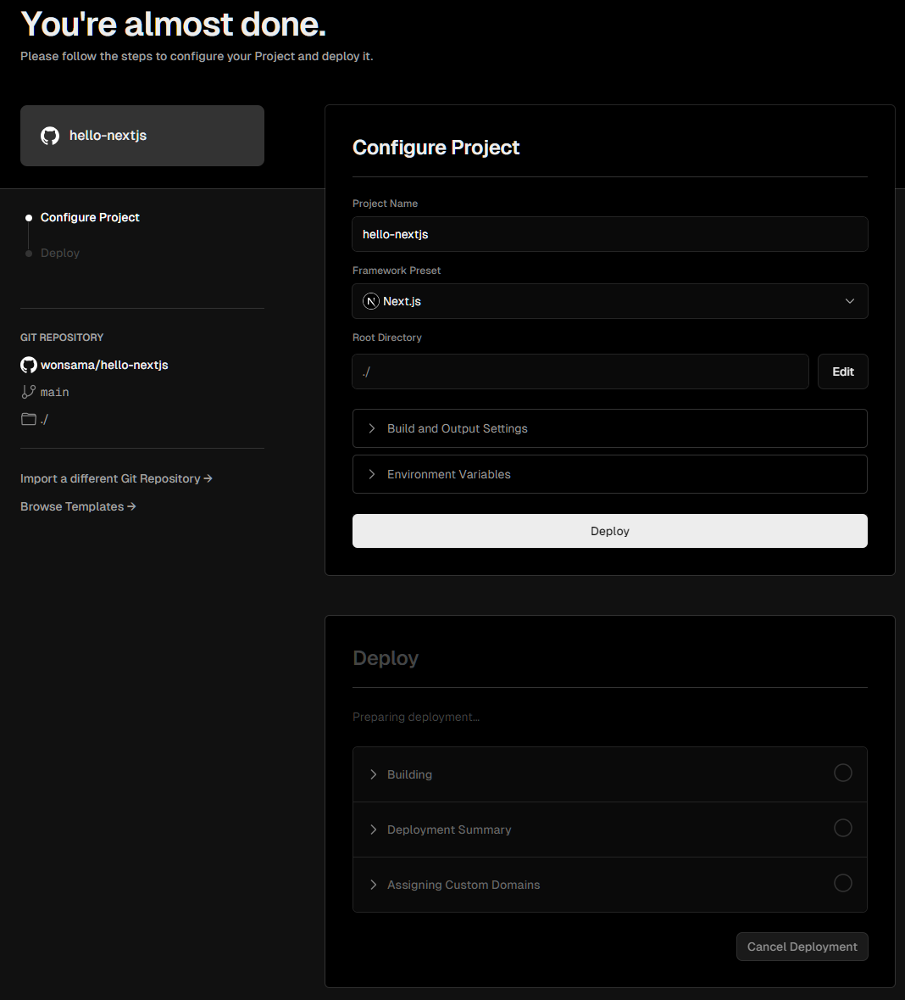
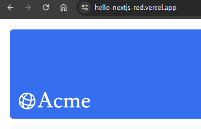
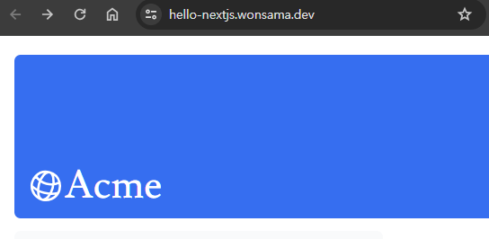
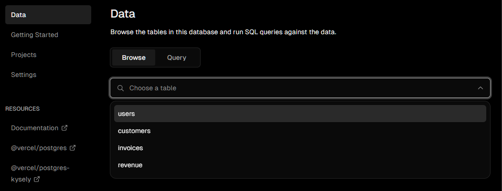

# 06 setting up your database

## 이 장에서 배울 것

- 프로젝트를 GitHub에 푸시하세요.
- 즉각적인 미리보기 및 배포를 위해 Vercel 계정을 설정하고 GitHub 저장소를 연결하세요.
- 프로젝트를 생성하고 Postgres 데이터베이스에 연결하세요.
- 초기 데이터로 데이터베이스를 시드합니다.

## vercel 계정 만들기 및 배포

- GitHub 저장소 생성
- [Vercel](https://vercel.com/)에 가입 ( GitHub 계정으로 가입하면 편리 )
- Github 프로젝트 연결
- Build command / Output directory / install command 를 추가로 설정 할 수 있다
- Deploy 버튼을 누르면 배포가 시작된다



도메인 연결 전 : vercel 에서 제공하는 도메인으로 접속 가능



도메인 연결 후 : 개인 도메인으로 접속 가능



## postgres 데이터베이스 생성 및 연결

> [vercel - dashboard](https://vercel.com/dashboard)

`add new - store - postgres - create`

database name : hello-nextjs

`.env.local` 탭 선택 후 `show secret` 버튼을 눌러 설정정보를 확인 후 복사한 내용을 복사하여 .env 파일을 생성 후 붙여넣는다.

`npm i @vercel/postgres` 를 입력하여 설치한다.

`/package.json` 파일에 seed 스크립트를 추가한다.

```json
"scripts": {
  "build": "next build",
  "dev": "next dev",
  "start": "next start",
  "seed": "node -r dotenv/config ./scripts/seed.js"
},
```

이후 `npm run seed` 를 입력하여 데이터베이스를 시드한다. 그럼 이후 아래와 같이 table 이 생성된 것을 확인할 수 있다.


