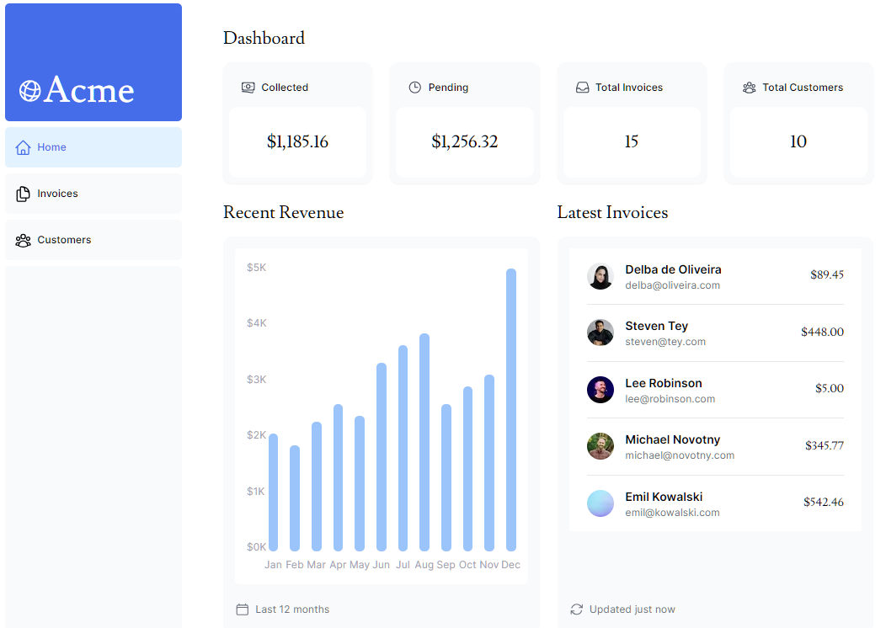
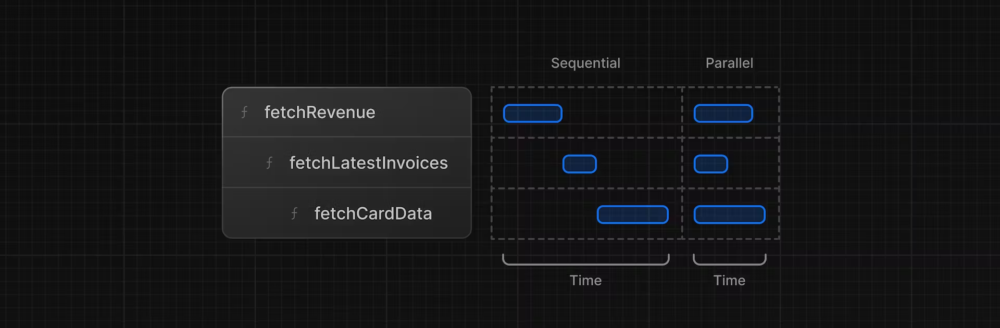

# 07 fetching data

## 이 장에서 배울 것

- API, ORM, SQL 등 데이터를 가져오는 몇 가지 접근 방식에 대해 알아보세요.
- 서버 구성 요소가 백엔드 리소스에 보다 안전하게 액세스하는 데 어떻게 도움이 됩니까?
- 네트워크 폭포수란 무엇입니까?
- JavaScript 패턴을 사용하여 병렬 데이터 가져오기를 구현하는 방법.

## 데이터베이스 쿼리

전체 스택 애플리케이션을 생성할 때 데이터베이스와 상호 작용하는 논리도 작성해야 합니다

- 관계형 데이터베이스의 경우 SQL 또는 ORM을 사용하여 작업을 진행합니다
- 클라이언트에서 데이터를 가져올 때에는 직접 쿼리하면 데이터베이스 비밀(암호)이 노출 되므로 유의

## 서버 구성 요소를 사용하여 데이터 가져오기

- Promise를 통한 비동기 작업 지원, useEffect 및 useState 구문 활용
- 서버에서 실행되므로 비용이 많이 드는 데이터 가져오기 및 논리를 서버에 보관하고 결과만 클라이언트로 보낼 수 있습니다.
- 서버에서 실행되기 때문에 별도의 API 계층 없이 데이터베이스에 직접 쿼리할 수 있습니다.

## SQL 사용

- SQL은 관계형 데이터베이스를 쿼리하기 위한 업계 표준입니다(예: ORM은 내부적으로 SQL을 생성합니다).
- SQL에 대한 기본적인 이해가 있으면 관계형 데이터베이스의 기본 사항을 이해하는 데 도움이 되며 지식을 다른 도구에 적용할 수 있습니다.
- SQL은 다목적이므로 특정 데이터를 가져오고 조작할 수 있습니다.
- Vercel Postgres SDK는 SQL 주입 에 대한 보호 기능을 제공합니다.

```ts
// => /app/lib/data.ts
import { sql } from '@vercel/postgres';

// ...
```



## 요청 폭포수란 ?

"폭포수"는 이전 요청의 완료에 따라 달라지는 일련의 네트워크 요청을 나타냅니다. 데이터 가져오기의 경우 각 요청은 이전 요청이 데이터를 반환한 후에만 시작할 수 있습니다.



fetchRevenue()예를 들어, 실행을 시작하려면 먼저 실행될 때까지 기다려야 합니다 fetchLatestInvoices().

```tsx
//=> /app/dashboard/page.tsx
const revenue = await fetchRevenue();
const latestInvoices = await fetchLatestInvoices(); // wait for fetchRevenue() to finish
const {
  numberOfInvoices,
  numberOfCustomers,
  totalPaidInvoices,
  totalPendingInvoices,
} = await fetchCardData(); // wait for fetchLatestInvoices() to finish
```

이 패턴이 반드시 나쁜 것은 아닙니다. 다음 요청을 하기 전에 조건이 충족되기를 원하기 때문에 폭포수를 원하는 경우가 있을 수 있습니다. 예를 들어 사용자 ID와 프로필 정보를 먼저 가져오고 싶을 수 있습니다. ID가 있으면 친구 목록을 가져올 수 있습니다. 이 경우 각 요청은 이전 요청에서 반환된 데이터에 따라 달라집니다.

그러나 이 동작은 의도하지 않은 것일 수도 있으며 성능에 영향을 미칠 수도 있습니다.

## 병렬 데이터 가져오기

폭포수를 방지하는 일반적인 방법은 모든 데이터 요청을 동시에 병렬로 시작하는 것입니다.

JavaScript에서는 다음을 사용할 수 있습니다. Promise.all() 또는 Promise.allSettled() 모든 약속을 동시에 시작하는 기능입니다. 예를 들어 에서는 다음 함수를 data.ts 사용하고 있습니다. Promise.all() fetchCardData()

이 패턴을 사용하면 다음을 수행할 수 있습니다.

- 모든 데이터 가져오기 실행을 동시에 시작하면 성능이 향상될 수 있습니다.
- 모든 라이브러리나 프레임워크에 적용할 수 있는 기본 JavaScript 패턴을 사용하세요.

그러나 이 JavaScript 패턴에만 의존하면 한 가지 단점이 있습니다 . 하나의 데이터 요청이 다른 모든 데이터 요청보다 느리면 어떻게 될까요 ? ( cascade 형태의 데이터 로드 시 문제 발생 가능 함에 유의 )

```js
//=> /app/lib/data.js
export async function fetchCardData() {
  try {
    const invoiceCountPromise = sql`SELECT COUNT(*) FROM invoices`;
    const customerCountPromise = sql`SELECT COUNT(*) FROM customers`;
    const invoiceStatusPromise = sql`SELECT
         SUM(CASE WHEN status = 'paid' THEN amount ELSE 0 END) AS "paid",
         SUM(CASE WHEN status = 'pending' THEN amount ELSE 0 END) AS "pending"
         FROM invoices`;

    const data = await Promise.all([
      invoiceCountPromise,
      customerCountPromise,
      invoiceStatusPromise,
    ]);
    // ...
  }
}
```
