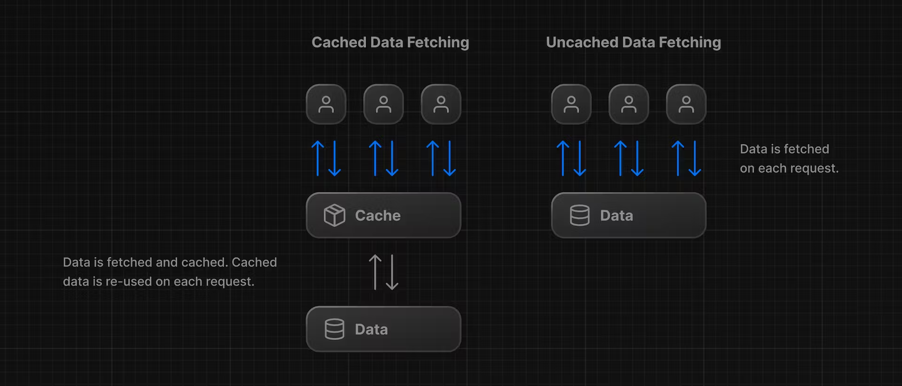

# 08 static and dynamic rendering

## 이 장에서 배울 것

- 정적 렌더링이 무엇이며 애플리케이션 성능을 어떻게 향상시킬 수 있는지 알아보세요.
- 동적 렌더링이란 무엇이며 언제 사용해야 할까요?
- 대시보드를 동적으로 만드는 다양한 접근 방식.
- 느린 데이터 가져오기를 시뮬레이션하여 무슨 일이 일어나는지 확인하세요.

## 정적 렌더링이란 ?

사용자가 애플리케이션을 방문할 때마다 캐시된 결과가 제공됩니다. 정적 렌더링에는 몇 가지 이점이 있습니다.

- 더 빠른 웹사이트 - 사전 렌더링된 콘텐츠를 캐시하고 전 세계적으로 배포할 수 있습니다. 이를 통해 전 세계 사용자가 웹사이트 콘텐츠에 더욱 빠르고 안정적으로 액세스할 수 있습니다.
- 서버 로드 감소 - 콘텐츠가 캐시되기 때문에 서버는 각 사용자 요청에 대해 콘텐츠를 동적으로 생성할 필요가 없습니다.
- SEO - 사전 렌더링된 콘텐츠는 페이지가 로드될 때 이미 콘텐츠를 사용할 수 있으므로 검색 엔진 크롤러가 색인을 생성하기가 더 쉽습니다. 이를 통해 검색 엔진 순위가 향상될 수 있습니다.

정적 렌더링은 정적 블로그 게시물이나 제품 페이지와 같이 사용자 간에 공유되는 데이터 나 데이터가 없는 UI에 유용합니다 . 정기적으로 업데이트되는 개인화된 데이터가 있는 대시보드에는 적합하지 않을 수 있습니다.



## 동적 렌더링이란 ?

동적 렌더링을 사용하면 요청 시 (사용자가 페이지를 방문할 때) 각 사용자의 콘텐츠가 서버에서 렌더링됩니다 . 동적 렌더링에는 몇 가지 이점이 있습니다.

- 실시간 데이터 - 동적 렌더링을 통해 애플리케이션은 실시간 또는 자주 업데이트되는 데이터를 표시할 수 있습니다. 이는 데이터가 자주 변경되는 애플리케이션에 이상적입니다.
- 사용자별 콘텐츠 - 대시보드나 사용자 프로필과 같은 개인화된 콘텐츠를 제공하고 사용자 상호 작용을 기반으로 데이터를 업데이트하는 것이 더 쉽습니다.
- 요청 시간 정보 - 동적 렌더링을 사용하면 쿠키나 URL 검색 매개변수와 같이 요청 시간에만 알 수 있는 정보에 액세스할 수 있습니다.

## 대시보드를 동적으로 만들기

기본적으로 `@vercel/postgres` 자체 캐싱을 설정하지 않습니다. 이를 통해 프레임워크는 자체 정적 및 동적 동작을 설정할 수 있습니다.

서버 구성 요소 내부에서 호출되는 Next.js API `unstable_noStore` 나 데이터 가져오기 기능을 사용하여 정적 렌더링을 거부할 수 있습니다.

> 참고: `unstable_noStore` 실험적인 API이며 향후 변경될 수 있습니다.

```ts
//=> /app/lib/data.ts
// ...
import { unstable_noStore as noStore } from 'next/cache';

export async function fetchRevenue() {
  // Add noStore() here to prevent the response from being cached.
  // This is equivalent to in fetch(..., {cache: 'no-store'}).
  noStore();

  // ...
}

export async function fetchLatestInvoices() {
  noStore();
  // ...
}

export async function fetchCardData() {
  noStore();
  // ...
}

export async function fetchFilteredInvoices(
  query: string,
  currentPage: number,
) {
  noStore();
  // ...
}

export async function fetchInvoicesPages(query: string) {
  noStore();
  // ...
}

export async function fetchFilteredCustomers(query: string) {
  noStore();
  // ...
}

export async function fetchInvoiceById(query: string) {
  noStore();
  // ...
}
```

## 느린 데이터 가져오기 시뮬레이션

```ts
//=> /app/lib/data.ts
export async function fetchRevenue() {
  try {
    // We artificially delay a response for demo purposes.
    // Don't do this in production :)
    console.log('Fetching revenue data...');
    await new Promise((resolve) => setTimeout(resolve, 3000));

    const data = await sql<Revenue>`SELECT * FROM revenue`;

    console.log('Data fetch completed after 3 seconds.');

    return data.rows;
  } catch (error) {
    console.error('Database Error:', error);
    throw new Error('Failed to fetch revenue data.');
  }
}
```

이제 [http://localhost:3000/dashboard/](http://localhost:3000/dashboard/) 를 엽니다.새 탭에서 페이지를 로드하는 데 시간이 얼마나 오래 걸리는지 확인하세요.

여기서는 느린 데이터 가져오기를 시뮬레이션하기 위해 인위적인 3초 지연을 추가했습니다. 그 결과 이제 데이터를 가져오는 동안 전체 페이지가 차단됩니다.

개발자가 해결해야 하는 공통 과제는 다음과 같습니다.

동적 렌더링을 사용하면 애플리케이션 속도는 가장 느린 데이터를 가져오는 속도만큼만 빨라집니다.

> refresh 또는 주소 직접 입력의 경우 캐싱이 되지 않으나, Navbar `<Link>` 를 통한 화면 이동의 경우에는 prefecching이 된 결과를 리턴하기 때문에 화면 갱신이 이뤄지지 않음에 유의한다. (어느 시점에 화면을 갱신 처리를 하는가에 대한 고민이 필요)
