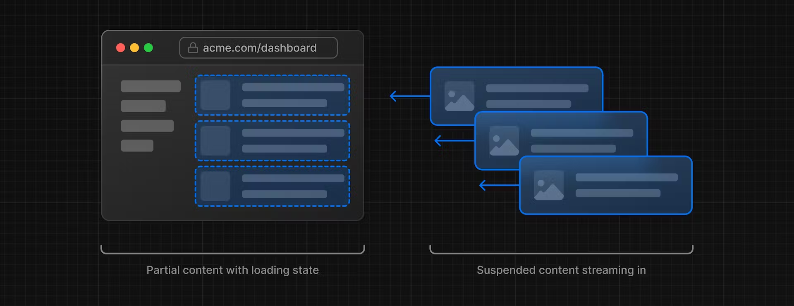
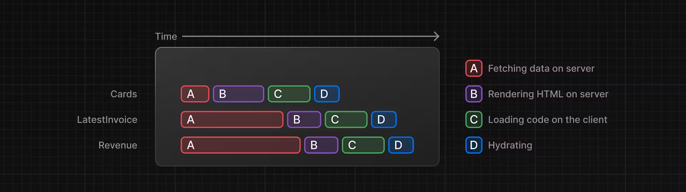
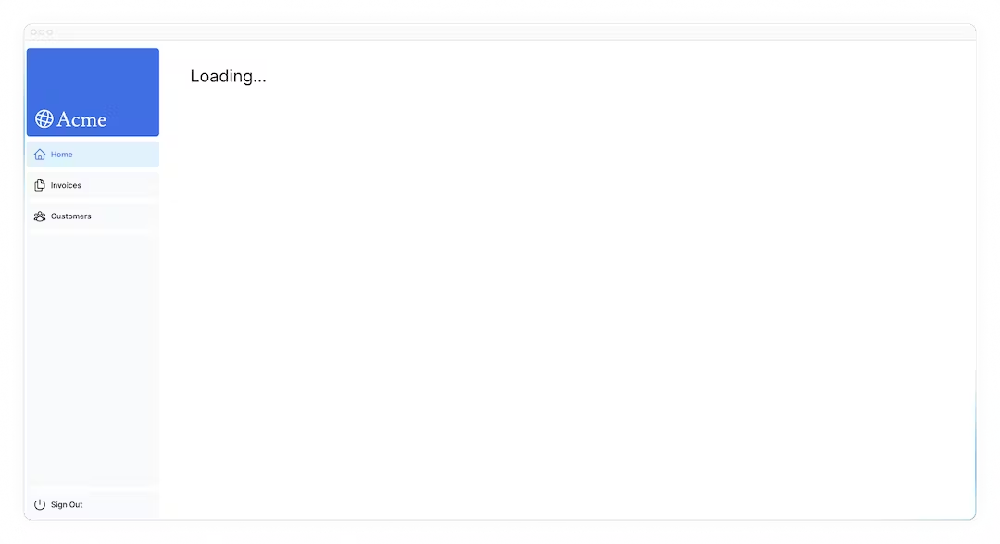
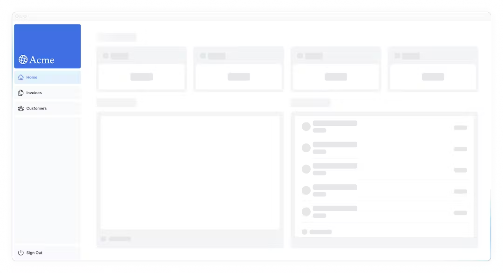
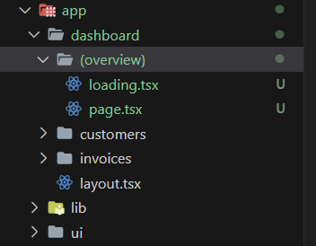
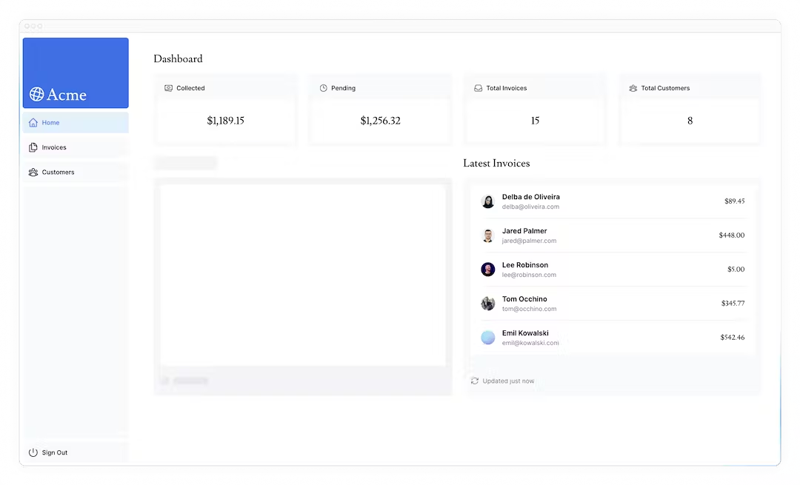

# 09 streaming

## 이 장에서 배울 것

- 스트리밍이란 무엇이며 언제 사용할 수 있나요?
- Suspense를 사용하여 스트리밍을 구현하는 방법 loading.tsx.
- 로딩 스켈레톤이란 무엇입니까?
- 경로 그룹은 무엇이며 언제 사용할 수 있습니까?
- 애플리케이션에서 Suspense 경계를 배치할 위치입니다.

## 스트리밍이란 ?

스트리밍은 경로를 더 작은 "청크"로 나누고 준비가 되면 서버에서 클라이언트로 점진적으로 스트리밍할 수 있는 데이터 전송 기술입니다. 스트리밍하면 느린 데이터 요청이 전체 페이지를 차단하는 것을 방지할 수 있습니다. 이를 통해 사용자는 UI가 사용자에게 표시되기 전에 모든 데이터가 로드될 때까지 기다리지 않고 페이지의 일부를 보고 상호 작용할 수 있습니다.

Next.js에서 스트리밍을 구현하는 방법에는 두 가지가 있습니다.

1. 페이지 수준에서 `loading.tsx` 파일을 사용
2. `<Suspense>` 사용

( Suspense : 미결, 정지 )





## 전체 페이지 스트리밍 loading.tsx



```tsx
//=> /app/dashboard/loading.tsx
export default function Loading() {
  return <div>Loading...</div>;
}
```

여기서는 몇 가지 일이 일어나고 있습니다.

1. `loading.tsxSuspense` 를 기반으로 구축된 특별한 Next.js 파일로, 페이지 콘텐츠가 로드되는 동안 대체 UI로 표시할 폴백 UI를 생성할 수 있습니다.

2. 정적 페이지 `<SideNav>` 는 즉시 표시됩니다. 사용자는 `<SideNav>` 동적 콘텐츠가 로드되는 동안 상호 작용할 수 있습니다.

3. 사용자는 다른 페이지로 이동하기 전에 페이지 로드가 완료될 때까지 기다릴 필요가 없습니다 (이를 중단 가능한 탐색이라고 함)

## 로딩 빼대 추가



로딩 스켈레톤은 UI의 단순화된 버전입니다. 많은 웹사이트에서는 이를 자리 표시자(또는 대체)로 사용하여 사용자에게 콘텐츠가 로드 중임을 나타냅니다.

```tsx
//=> /app/dashboard/loading.tsx
export default function Loading() {
  return <DashboardSkeleton />;
}
```

## 경로 그룹 로드 뼈대 버그 수정

현재 로딩 뼈대는 송장 `/dashboard/invoices` 및 고객 페이지 `/dashboard/customers` 에도 적용됩니다. 이를 해결하기 위해 경로 그룹을 생성하여 사용합니다. `(overview)`



이제 loading.tsx파일은 대시보드 개요 페이지에만 적용됩니다. 여기에서는 대시보드 개요 페이지에만 적용되도록 경로 그룹을 사용하고 있습니다 . 그러나 경로 그룹을 사용하여 애플리케이션을 섹션(예: (marketing)경로 및 (shop)경로)으로 분리하거나 대규모 애플리케이션의 경우 팀별로 분리할 수도 있습니다.

## 구성요소 스트리밍

지금까지는 전체 페이지를 스트리밍하고 있습니다. 하지만 그 대신 React Suspense를 사용하면 더욱 세분화되고 특정 구성 요소를 스트리밍할 수 있습니다.

Suspense를 사용하면 일부 조건이 충족될 때까지(예: 데이터 로드) 애플리케이션의 렌더링 부분을 연기할 수 있습니다. Suspense에서 동적 구성요소를 래핑할 수 있습니다. 그런 다음 동적 구성요소가 로드되는 동안 표시할 대체 구성요소를 전달합니다.

느린 데이터 요청을 기억하신다면 fetchRevenue()이는 전체 페이지의 속도를 늦추는 요청입니다. 페이지를 차단하는 대신 Suspense를 사용하여 이 구성 요소만 스트리밍하고 페이지 UI의 나머지 부분을 즉시 표시할 수 있습니다.



```tsx
// 참조 아래 메소드를
// 기존 /dashboard/page.tsx => /invovice/revenue-chart.tsx
// 해당 위치로 변경 처리
const revenue = await fetchRevenue();

// /dashboard/page.tsx 변경 전
<RevenueChart revenue={revenue} />

// /dashboard/page.tsx 변경 후
<Suspense fallback={<RevenueChartSkeleton />}>
    <RevenueChart />
</Suspense>
```

## 구성요소 그룹화

기존 `Card` 에 대해 개별 Suspense를 적용하면 코드가 복잡해질 수 있습니다. 각 개별 카드에 대한 데이터를 가져올 수 있지만 이로 인해 카드가 로드될 때 팝업 효과가 발생할 수 있으며 이는 사용자에게 시각적으로 불편할 수 있습니다.

```tsx
//=> app\dashboard\(overview)\page.tsx
<Suspense fallback={<CardsSkeleton />}>
  <CardWrapper />
</Suspense>
```

페이지를 새로 고치면 모든 카드가 동시에 로드되는 것을 볼 수 있습니다. 여러 구성요소를 동시에 로드하려는 경우 이 패턴을 사용할 수 있습니다.

## Suspense 경계를 배치할 위치 결정

Suspense 경계를 배치하는 위치는 다음 몇 가지 사항에 따라 달라집니다.

1. 페이지가 스트리밍될 때 사용자가 페이지를 경험하기를 원하는 방식입니다.
2. 어떤 콘텐츠에 우선순위를 두고 싶은지.
3. 구성요소가 데이터 가져오기에 의존하는 경우.

대시보드 페이지를 살펴보세요. 다르게 수행했을 만한 작업이 있습니까?

괜찮아요. 정답은 없습니다.

- ... 에서 했던 것처럼 전체 페이지를 스트리밍할 수 loading.tsx있지만 구성 요소 중 하나의 데이터 가져오기 속도가 느린 경우 로드 시간이 길어질 수 있습니다.
- 모든 구성 요소를 개별적으로 스트리밍할 수 있지만 UI가 준비되면 화면에 갑자기 나타날 수 있습니다.
- 페이지 섹션을 스트리밍하여 시차 효과를 만들 수도 있습니다 . 하지만 래퍼 구성 요소를 만들어야 합니다.

서스펜스 경계를 ​​배치하는 위치는 애플리케이션에 따라 달라집니다. 일반적으로 데이터 가져오기를 필요한 구성 요소로 이동한 다음 Suspense에서 해당 구성 요소를 래핑하는 것이 좋습니다. 그러나 애플리케이션에 필요한 경우 섹션이나 전체 페이지를 스트리밍하는 데 아무런 문제가 없습니다.

Suspense를 실험해보고 가장 효과적인 것이 무엇인지 알아보는 것을 두려워하지 마십시오. Suspense는 더욱 즐거운 사용자 경험을 만드는 데 도움이 될 수 있는 강력한 API입니다.

## 참조링크

- [route-groups](https://nextjs.org/docs/app/building-your-application/routing/route-groups)

```

```
