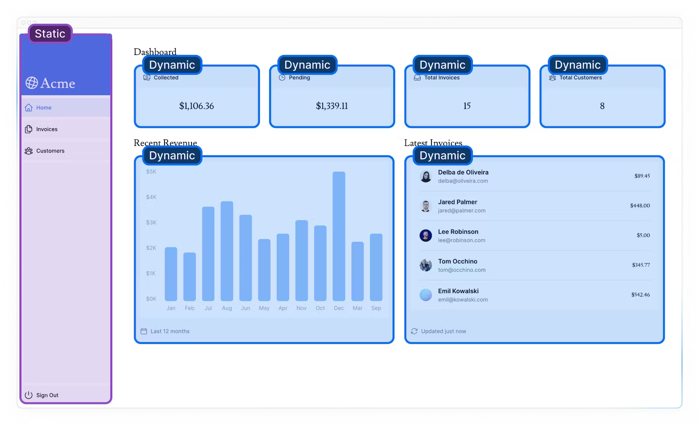
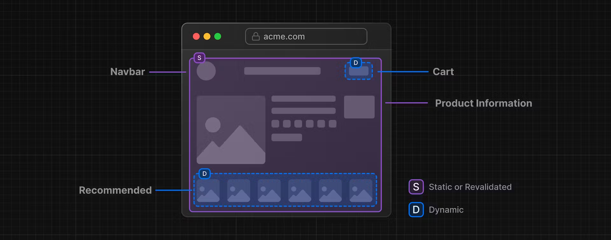

# 10 Partial Prerendering (Optional)

## 이 장에서 배울 것

- 부분 사전 렌더링이란 무엇입니까?
- 부분 사전 렌더링의 작동 방식

## 정적 콘텐츠와 동적 콘텐츠 결합

현재 경로 내에서 동적 함수를 호출하면 전체 경로가 동적이 됩니다.

이것이 오늘날 대부분의 웹 앱이 구축되는 방식입니다. 전체 애플리케이션 이나 특정 경로 에 대해 정적 렌더링과 동적 렌더링 중에서 선택합니다.

그러나 대부분의 경로는 완전히 정적이거나 동적 이지 않습니다. 정적 콘텐츠와 동적 콘텐츠가 모두 포함된 경로가 있을 수 있습니다.

- `<SideNav>` 요소는 데이터에 의존하지 않으며 사용자에게 개인화되지 않으므로 정적 일 수 있습니다 .
- `<Page>` 요소는 자주 변경되는 데이터에 의존하고 사용자에게 개인화되므로 동적 일 수 있습니다 .

## 부분 사전 렌더링이란 무엇입니까?

Next.js 14 에는 일부 부분을 동적으로 유지하면서 정적 로딩 셸을 사용하여 경로를 렌더링할 수 있는 실험적인 기능인 부분 사전 렌더링 의 미리 보기가 포함되어 있습니다 . 즉, 경로의 동적 부분을 분리할 수 있습니다.

사용자가 경로를 방문할 때:

- 정적 경로 셸이 제공되어 빠른 초기 로드를 보장합니다.
- 셸에는 동적 콘텐츠가 비동기식으로 로드되는 구멍이 남습니다.
- 비동기 홀은 병렬로 스트리밍되어 페이지의 전체 로드 시간을 줄입니다.

이는 전체 경로가 완전히 정적이거나 동적인 오늘날 애플리케이션의 작동 방식과 다릅니다.

## 부분 사전 렌더링은 어떻게 작동하나요?

부분 사전 렌더링의 가장 큰 장점은 이를 사용하기 위해 코드를 변경할 필요가 없다는 것입니다. Suspense를 사용하여 경로의 동적 부분을 래핑하는 한 Next.js는 경로의 어느 부분이 정적이고 어느 부분이 동적인지 알 수 있습니다.

## 참조링크

- [partial-prerendering-with-next-js](https://vercel.com/blog/partial-prerendering-with-next-js-creating-a-new-default-rendering-model)
